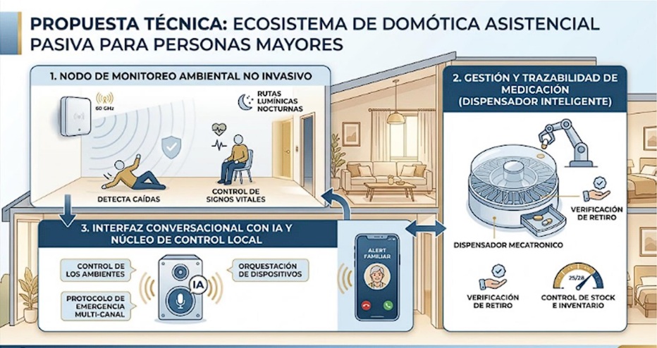

# Hábitat Asistencial Seguro e Inteligente

**Ecosistema de domótica asistencial pasiva para el cuidado de adultos mayores en su propio hogar**

Este proyecto desarrolla un ecosistema integrado por tres dispositivos —un radar de monitoreo no invasivo, un dispensador de medicación inteligente y una interfaz conversacional con IA— que trabajan de forma orquestada para proteger a la persona mayor sin cámaras, sin wearables y sin interfaces complejas.

---

## Tabla de contenidos

- [Descripción](#descripción)
- [Objetivos](#objetivos)
- [Funcionamiento general](#funcionamiento-general)
- [Componentes principales](#componentes-principales)

---

## Descripción

El sistema despliega un **Hábitat Asistencial Seguro e Inteligente** pensado para que la persona mayor pueda envejecer en su propio hogar (*Aging in Place*) de forma autónoma, digna y segura. En vez de depender de wearables que se olvidan de usar o cámaras que invaden la privacidad, la solución combina sensado ambiental no invasivo, automatización de la salud y procesamiento de lenguaje natural, todo operando de forma coordinada para tejer una capa invisible de seguridad y acompañamiento en la vivienda.

## Objetivos

- Detectar caídas e inmovilidad en tiempo real sin usar cámaras.
- Garantizar la correcta administración y trazabilidad de la medicación diaria.
- Permitir el control del hogar y la comunicación con familiares mediante voz natural, sin apps ni menús complejos.
- Activar un protocolo de emergencia automático ante una situación crítica, sin depender de que la persona sepa pedir ayuda.
- Preservar en todo momento la autonomía, comodidad e intimidad del usuario.

## Funcionamiento general

1. **Monitoreo pasivo**: el radar mmWave detecta la posición y presencia de la persona en el ambiente, identificando caídas, inmovilidad y signos vitales básicos sin contacto ni cámaras.
2. **Gestión de medicación**: el dispensador libera la dosis programada y verifica, mediante sensores, que haya sido efectivamente retirada.
3. **Orquestación de eventos**: el núcleo de control local cruza la información de ambos dispositivos (por ejemplo, "pastilla no retirada" o "inmovilidad inusual") y decide la acción a tomar.
4. **Interacción por voz**: la interfaz conversacional avisa, recuerda o consulta el estado del usuario en lenguaje natural ("¿te encontrás bien?"), y permite controlar el ambiente (luces, temperatura) con comandos simples.
5. **Protocolo de emergencia**: si el sistema detecta una situación crítica y no recibe respuesta, dispara automáticamente llamadas o mensajes a familiares y cuidadores.

## Componentes principales

- **Nodo de Monitoreo Ambiental (Radar mmWave 60 GHz)** — detección de caídas, signos vitales sin contacto y presencia para automatizar iluminación y climatización.
- **Dispensador de Pastillas Inteligente** — dosificación automatizada, verificación de retiro y control de stock.
- **Interfaz Conversacional con IA y Núcleo de Control Local** — interacción por voz, orquestación entre dispositivos y protocolo de emergencia multi-canal.
